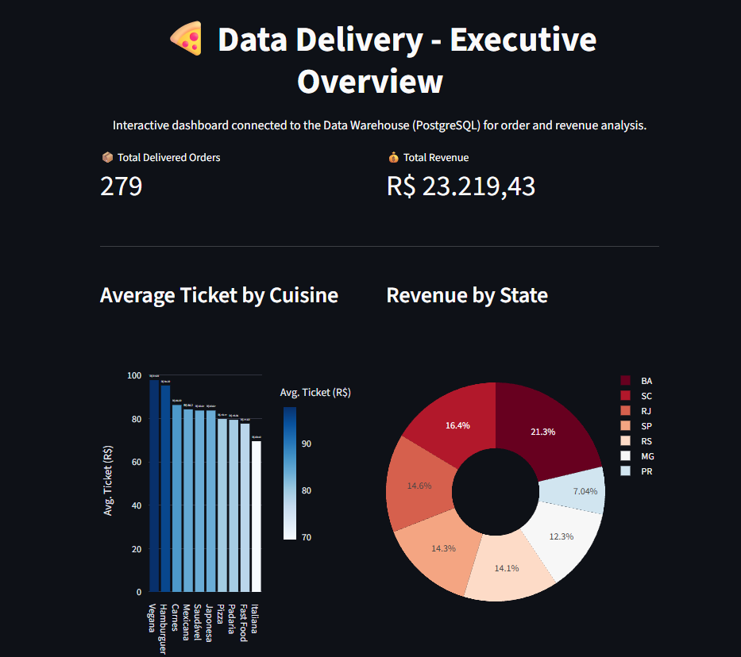
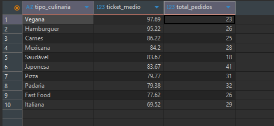
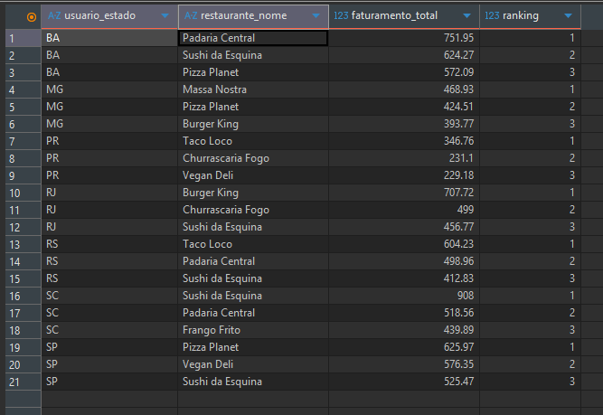
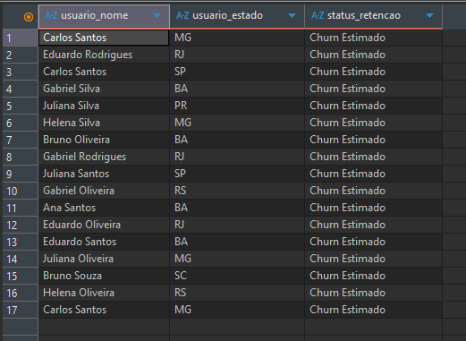

# 🍕 Data Delivery Project: ETL & Dimensional Modeling

## 📈 Interactive Dashboard (Streamlit)

An executive dashboard built with Streamlit and Plotly connects directly to the Data Warehouse and displays KPIs, charts, and a ranking table in real time.

**Features:**
- Total delivered orders and total revenue KPIs
- Average ticket per cuisine type (bar chart)
- Revenue distribution by state (donut chart)
- Revenue ranking table by restaurant and state



---

## 📖 Overview

This project simulates the data environment of a food delivery application. The goal is to extract raw data (CSV and JSON files), clean and transform it using Python (Pandas), load it into a relational PostgreSQL database (via Docker), and build a Data Warehouse using the Star Schema methodology to answer complex business questions through Advanced SQL.

---

## 🛠️ Architecture & Technologies

| Layer | Technology |
|---|---|
| Language | Python (Pandas, SQLAlchemy) |
| Database | PostgreSQL 15 |
| Infrastructure | Docker & Docker Compose |
| Orchestration (Conceptual) | Simple DAG |
| Analysis | SQL (CTEs, Window Functions, Aggregations) |
| Dashboard | Streamlit & Plotly |
| DB Tool | DBeaver |

---

## 🏗️ Data Warehouse Structure

Data was modeled following Ralph Kimball's methodology (Star Schema), split into a `raw` layer (raw ingested data) and a `dw` layer (modeled and optimized data).

---

## 🚀 How to Reproduce This Project

### 1. Prerequisites

- Docker installed
- Python (or Miniconda) installed

### 2. Environment Setup

Clone this repository and spin up the database via Docker:

```bash
git clone https://github.com/aikoandre/data-delivery.git
cd data-delivery

# Start the PostgreSQL container (running on port 5433)
docker-compose up -d
```

Install Python dependencies:

```bash
pip install pandas sqlalchemy psycopg2-binary
```

### 3. Running the Pipeline

**Step 1:** Generate synthetic data
```bash
python scripts/gerar_dados.py
```

**Step 2:** Ingest & clean data (Raw Layer)
```bash
python scripts/ingestao_dados.py
```

**Step 3:** Dimensional modeling (DW Layer)
```bash
python scripts/modelagem_dw.py
```

**Step 4:** Launch the interactive dashboard
```bash
pip install streamlit plotly
streamlit run scripts/dashboard.py
```

---

## 📊 Analyses & Results (Business Intelligence)

With the DW ready, three critical business questions were answered using SQL (scripts available in the `/sql` folder):

### 1. Average Ticket by Cuisine Type

Analysis of the most profitable categories to guide marketing campaigns.



---

### 2. Top 3 Restaurants by Revenue per State

Using Window Functions (`DENSE_RANK()`) for partitioned ranking.



---

### 3. Retention Analysis (Churn)

Identifying users who purchased last month but did not return in the current month, using CTEs and Anti-Joins.



---


## �🔜 Next Steps (Future Improvements)

- Implement **dbt** (Data Build Tool) to manage SQL transformations.
- Migrate the local database to a Cloud Data Warehouse (e.g., Google BigQuery).
- Connect the database to a visualization tool (Power BI / Metabase).

---

*Developed as a Data Engineering portfolio project.*